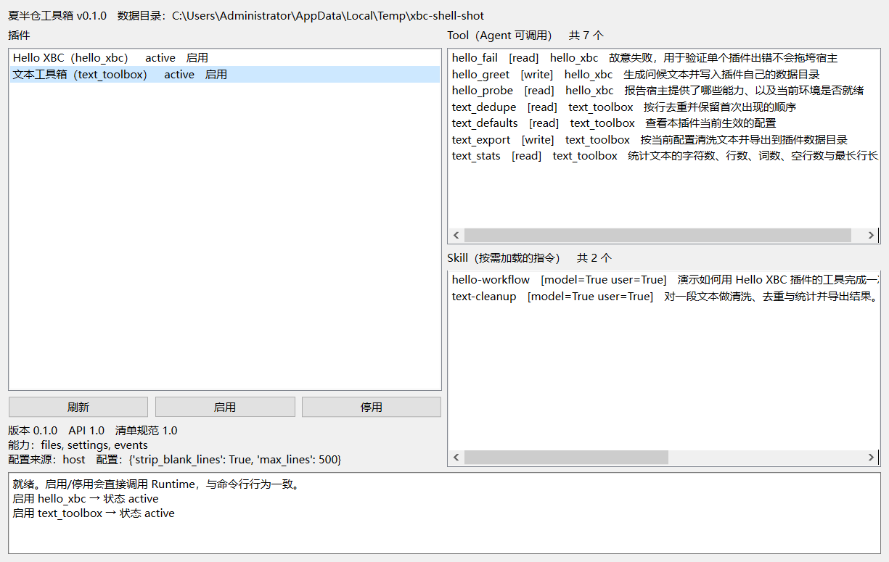

# 夏半仓工具箱（XBC）

一个**可插件化**的 Windows 本地工具平台内核。

当前阶段已完成 **Plugin Runtime V1** 与 **Desktop Shell MVP**：插件可以安装、发现、激活、配置、停用、卸载；
插件通过明确的契约向 Agent 提供**工具**与**技能**；内核不认识任何具体插件；
桌面端提供最小管理入口，且**操作结果与运行时状态一致**（界面不缓存状态）。

> 技术方案：[docs/plugin-runtime-v1.md](docs/plugin-runtime-v1.md)
> 测试报告与验收结果：[docs/plugin-runtime-v1-test-report.md](docs/plugin-runtime-v1-test-report.md)
> 任务台账：[TASKS.md](TASKS.md)



---

## 设计要点

| 决策 | 原因 |
|---|---|
| **内核零第三方依赖**（只用标准库） | 内核永远能跑起来；连 JSON Schema 校验器都是自研的 |
| **内核不含 Qt** | 图形界面只是内核的消费者；插件机制能脱离界面被测试 |
| **Capability / Service / Tool 三者分清** | Capability 是**内核给插件的**；Service 是**插件给插件的**；Tool 是**插件给 Agent 的** |
| **注册即资源**（Scope / effect） | 每次注册都挂到作用域上，停用时统一释放。**插件不需要写清理代码** |
| **能力需要声明** | 清单里没写的能力，访问时直接 `CapabilityDenied` |
| **风险由内核强制，不信插件自报** | 插件声明 `risk:"read"` 只是提示；`write`/`destructive` 工具必须经过授权回调 |
| **单插件失败被隔离** | 导入失败、`apply` 抛异常、工具执行失败、事件处理器失败、钩子失败 —— 五处都不拖垮宿主 |
| **三层配置 + 整对象替换** | 默认层 / 宿主层 / 用户层；用户配置跨版本存活；`config` 整体替换，语义可预测 |
| **技能是说明书，不是代码** | Skill 是 Markdown，改流程不用发版、不用重启 |
| **双版本字段** | `spec_version`（清单规范）+ `api_version`（内核契约），前者可降级、后者严格拒绝 |

---

## 目录结构

```
XBC/
├─ run.py                    开发期启动脚本（免安装）
├─ config/plugins.json       宿主层插件配置（L2，随内核发布）
├─ src/xbc/
│  ├─ version.py             版本与 API 契约
│  ├─ __main__.py            命令行入口（唯一操作界面）
│  ├─ core/                  内核：零第三方依赖、不含 Qt
│  │  ├─ contract/           契约：清单 / 钩子 / 插件基类
│  │  ├─ runtime/            运行时：作用域 / 分层注册表 / 生命周期
│  │  ├─ capabilities/       能力：files / ffmpeg / events / settings
│  │  │  └─ ai/              AI 能力层：接口 + Provider 抽象 + providers/（ollama / openai_compatible）
│  │  ├─ tools/              工具注册表 + JSON Schema 校验（自研）
│  │  ├─ skills/             技能注册表（目录 / 按需加载 / 调用策略）
│  │  ├─ config/             三层配置装配
│  │  ├─ packaging/          包格式 / 版本比较 / 安装·卸载·升级
│  │  ├─ diagnostics.py      环境体检 + 运行时诊断
│  │  └─ context.py          AppContext（内核）/ PluginContext（受限视图）
│  └─ ui/shell.py            桌面管理入口（插件列表/状态、启用停用、Tool/Skill 列表）
├─ plugins/                  内置插件
│  ├─ hello_xbc/             机制验证插件
│  ├─ text_toolbox/          真实业务插件：纯本地文本处理
│  └─ video_analyzer/        真实业务插件：FFmpeg 媒体信息 + 镜头切分 + 关键帧抽取
├─ tests/                    278 项测试
└─ docs/                     技术方案、测试报告、调研报告
```

---

## 快速开始

```powershell
# 端到端冒烟：发现 → 加载 → 激活 → 调用只读工具 → 停用 → 卸载
python run.py smoke

# 完整体检（环境 + 插件运行时）
python run.py doctor

# 插件（**不导入代码**即可列出，这就是"零成本清单"）
python run.py plugin list
python run.py plugin show text_toolbox
python run.py plugin disable text_toolbox     # 持久化到用户层配置
python run.py plugin enable text_toolbox

# 插件包：打包 / 安装 / 升级 / 卸载
python run.py plugin build plugins/video_analyzer        # → video_analyzer-0.1.0.xbcplugin
python run.py plugin install video_analyzer-0.1.0.xbcplugin
python run.py plugin upgrade video_analyzer-0.2.0.xbcplugin
python run.py plugin installed                           # 已安装版本与安装台账
python run.py plugin uninstall video_analyzer            # 保留用户数据
python run.py plugin uninstall video_analyzer --purge    # 连用户数据与配置一起清

# 工具（Agent 视角，带 inputSchema 与风险注解）
python run.py tool list
python run.py tool call text_stats --kwargs "{\"text\": \"a\nb\na\"}"
python run.py --yes tool call hello_greet     # write 工具需要显式授权

# 技能（目录只给名称+描述，正文按需加载）
python run.py skill list
python run.py skill load text-cleanup

# AI 能力（本地模型；插件只能通过 ctx.ai 使用，不得直接调模型）
python run.py tool call ai_status --kwargs "{\"probe\": true}"
python run.py tool call ai_text --kwargs "{\"prompt\": \"用一句话说明什么是镜头切分\"}"
python run.py tool call ai_embed --kwargs "{\"texts\": [\"镜头切分\", \"关键帧\"]}"

# 桌面管理入口（插件列表/状态、启用停用、Tool 与 Skill 列表）
python run.py ui
```

跑测试：

```powershell
python -m unittest discover -s tests          # 期望 Ran 123 tests / OK
```

---

## 插件包与安装升级

### 包格式

插件包就是一个 ZIP 归档，扩展名 `.xbcplugin`（也接受 `.zip`）：

```
video_analyzer-0.1.0.xbcplugin
├─ plugin.json          清单（必需，位于归档根目录）
├─ plugin.py            入口（必须与清单 entry 声明一致）
├─ skills/…             可选
└─ assets/…             可选
```

**没有引入额外的清单文件** —— 包里就是插件目录本身，`plugin.json` 既是运行期清单、
也是包的元数据源。少一个概念，就少一处会不同步的地方。

解包时做了三层防护：拒绝**路径穿越**（zip-slip）、拒绝**符号链接**、限制**解压体积**。
打包与安装都会校验**版本号可比较**与**入口文件确实存在** —— 让不合规的包在发布/安装环节就被拦住，
而不是等用户装完了才发现加载失败。

### 安装是原子的

安装与升级都是「解到临时目录 `.staging-*` → 校验 → 原子替换」。任何一步失败自动回滚，
不会留下半个插件。`discover()` 会跳过 `.` 开头的目录，所以扫描时看不到半成品。

### 版本与重名裁决

- 版本用 SemVer 子集比较（`1.2.10 > 1.2.9`，`1.0.0-beta < 1.0.0`）；
- **升级**默认只接受更高的版本；同版本或降级会被拒绝，需要 `--force`；
- 插件同时存在于内置目录与用户目录时，**用户目录优先**（这是"用户升级了内置插件"的正常路径）。

### 用户数据目录分离

| 目录 | 内容 | 卸载（默认） | 卸载（`--purge`） | 升级 |
|---|---|---|---|---|
| `plugins/<id>/` | 插件代码 | **删除** | 删除 | **替换** |
| `cache/<id>/` | 可重建的缓存 | **删除** | 删除 | 保留 |
| `data/<id>/` | **用户数据** | **保留** | 删除 | 保留 |
| `config/` 中该插件的配置 | 用户配置 | **保留** | 删除 | 保留 |

**升级永远不会碰用户数据与配置** —— 所以升级不需要插件作者写迁移代码。

安装台账在 `<数据目录>/installed.json`，记录安装时间、来源包与升级历史。
注意：**版本以插件目录里的 `plugin.json` 为准**，台账只补安装元数据 ——
这样台账丢失或被手工改动也不会报出错误的版本。

---

## 插件怎么写

一个插件就是一个文件夹：

```
plugins/我的插件/
├─ plugin.json            清单
├─ plugin.py              入口
├─ skills/                本插件贡献的技能（可选）
│  └─ my-skill/SKILL.md
└─ assets/icon.svg        图标（可选，必须落在插件目录内）
```

**`plugin.json`**

```jsonc
{
  "id": "my_plugin",
  "name": "我的插件",
  "version": "0.1.0",
  "spec_version": "1.0",              // 清单规范版本：内核不认识的字段可降级忽略
  "api_version": "1.0",               // 内核契约：主版本必须匹配，否则拒绝加载
  "entry": "plugin.py:MyPlugin",
  "capabilities": ["files", "settings"],
  "tools": [
    { "name": "my_action", "description": "做一件事", "risk": "read" }
  ],
  "skills": ["my-skill"],
  "commands": [                        // 命令面板的声明式索引（界面消费）
    { "code": "my", "label": "我的功能", "match": { "type": "text", "keywords": ["关键词"] } }
  ],
  "config_schema": {
    "type": "object",
    "properties": { "limit": { "type": "integer", "default": 10, "minimum": 1 } }
  }
}
```

**`plugin.py`**

```python
from xbc.core.contract.plugin import XbcPlugin


class MyPlugin(XbcPlugin):
    def on_load(self):
        """代码已导入、上下文已注入。适合只依赖配置的准备工作。"""

    def apply(self, ctx, config):
        """注册阶段。所有注册自动挂到插件作用域，停用时统一释放。"""
        self.limit = config.get("limit", 10)

        ctx.tools.register(
            "my_action",
            self.my_action,
            description="做一件事",
            input_schema={"type": "object", "properties": {"text": {"type": "string"}}},
            output_schema={"type": "object", "required": ["ok"]},
            risk="read",          # read 免授权；write / destructive 需用户授权
        )
        ctx.skills.register_dir(ctx.package_dir / "skills")

    def my_action(self, text: str) -> dict:
        # 用公共能力做事，不要直接 open() / subprocess / requests
        target = self.ctx.files.write_text(self.ctx.data_dir / "out.txt", text)
        return {"ok": True, "file": str(target)}

    def on_unload(self):
        """模块移出内存前的最后清理。"""
```

### 插件能用的东西

**需要声明的能力**（清单 `capabilities`）：

| 能力 | 访问方式 | 用途 |
|---|---|---|
| `files` | `ctx.files` | 文件读写（统一编码、自动建目录） |
| `ffmpeg` | `ctx.ffmpeg` | 定位并调用 FFmpeg / ffprobe（不含业务参数） |
| `ai` | `ctx.ai` | 调用本地或云端模型（Provider 可替换） |
| `events` | `ctx.events` | 事件订阅/广播（**只用于通知**，不做请求-响应） |
| `settings` | `ctx.settings` | 插件自维护的键值（如调用次数） |

**始终可用**：

| 名字 | 用途 |
|---|---|
| `ctx.logger` | 带插件名前缀的日志 |
| `ctx.config` | 三层装配后的**有效配置**（只读） |
| `ctx.data_dir` / `ctx.cache_dir` | 插件私有目录（内核保证隔离） |
| `ctx.tools.register(...)` | 向 Agent 注册工具 |
| `ctx.skills.register(...)` / `register_dir(...)` | 贡献技能 |
| `ctx.services.provide(name, value)` / `ctx.get(name)` | 向其他插件提供/查找服务 |
| `ctx.effect(fn)` | 注册自定义资源并自动随作用域释放 |

### 生命周期

```
DISCOVERED ──load──▶ LOADED ──activate(apply)──▶ ACTIVE
                                                    │
                            INACTIVE ◀──deactivate（作用域释放）┘
                               │
                               └──unload──▶ UNLOADED

任意环节失败 → FAILED（记录可读原因，可重试；不影响其他插件与宿主）
```

---

## 开发环境

### 一键健康检查

```powershell
python run.py env       # 只查环境
python run.py doctor    # 环境 + 插件运行时
```

`env` 输出 `"status": "ok"` 即环境就绪；required 项失败时返回退出码 1。

| 级别 | 缺失后果 | 检查项 |
|---|---|---|
| `required` | 环境不可用（退出码 1） | Python ≥ 3.10、数据目录可写、插件目录存在 |
| `recommended` | 降级但可运行 | PySide6、git、FFmpeg |
| `optional` | 不影响环境健康 | 本地模型服务（Ollama） |

### 隔离环境

```powershell
python -m venv .venv
.venv\Scripts\python -m pip install -e ".[gui]"
```

> **工作区的完整性标签（重建 .venv 后必读）**
>
> `F:\Downloads\XBC` 根目录带有 `Mandatory Label\Low Mandatory Level:(OI)(CI)(NW)`，
> 由 DSH 沙箱写入，并且会被**在其中新建的所有文件继承**。后果是：放在工作区里的
> 任何可执行文件都会以 **Low 完整性**运行，被拒绝写入 `%TEMP%`、用户目录、
> `C:\Windows\Temp`。表现很隐蔽：`tempfile.gettempdir()` 会静默退化成当前目录，
> pip / 构建工具随机报"拒绝访问"。
>
> 因此**重建虚拟环境后需要执行一次**（只作用于 `.venv`，不动工作区本身）：
>
> ```powershell
> icacls .venv /setintegritylevel '(OI)(CI)M' /T /C
> ```
>
> **不要**重置工作区根目录的标签：沙箱在受限模式下依赖它。

### 运行期数据目录

```
%LOCALAPPDATA%\夏半仓工具箱\
├─ config/
│  ├─ plugins.json      用户层配置（跨版本存活，绝不覆盖）
│  └─ secrets.json      密钥（不进插件目录、不进仓库）
├─ plugins/             用户安装的插件（复制进来即安装，删掉即卸载）
├─ data/<plugin_id>/    插件私有数据（互相隔离）
├─ cache/<plugin_id>/
├─ skills/              用户自己的技能
└─ logs/xbc.log
```

用环境变量 `XBC_HOME` 可以把整个数据目录搬走（测试与便携版都靠它）。

---

## 内置插件

| 插件 | 定位 | 工具 |
|---|---|---|
| `hello_xbc` | 机制验证（生命周期、能力、错误隔离） | `hello_probe` / `hello_greet` / `hello_fail` |
| `text_toolbox` | 真实业务：纯本地文本处理 | `text_defaults` / `text_stats` / `text_dedupe` / `text_export` |
| `video_analyzer` | 真实业务：基于 FFmpeg 的视频结构分析 | `video_probe` / `video_split_shots` / `video_extract_keyframes` / `video_analyze` |
| `ai_test_plugin` | 验证 AI 能力层：只通过 `ctx.ai` 说话 | `ai_status` / `ai_text` / `ai_vision` / `ai_embed` |

### video_analyzer

只用 FFmpeg，**不含 AI、不联网、零第三方依赖**：

```powershell
# 读取媒体信息
python run.py tool call video_probe --kwargs "{`"path`": `"D:/clip.mp4`"}"

# 切分镜头（按画面变化）
python run.py tool call video_split_shots --kwargs "{`"path`": `"D:/clip.mp4`", `"threshold`": 0.3}"

# 抽取关键帧（写入插件自己的数据目录）
python run.py tool call video_extract_keyframes --kwargs "{`"path`": `"D:/clip.mp4`", `"frames_per_shot`": 3}"

# 一次拿到完整结构
python run.py tool call video_analyze --kwargs "{`"path`": `"D:/clip.mp4`"}"
```

> **Windows 提示**：PowerShell 会把 `--kwargs` 里的双引号吃掉。请用上面的反引号转义写法，
> 或 `cmd /c "python run.py ... --kwargs \"{...}\""`。

可配置项（用户层配置 `config/plugins.json`）：`scene_threshold`、`min_shot_seconds`、
`keyframes_per_shot`、`max_shots`、`frame_width`。

---

## AI 能力层

AI 是 **Core Capability**：插件通过 `ctx.ai` 使用，**不允许**直接调模型、直接发 HTTP、
直接 import 某个模型的 SDK。这条不是口号 —— 有一条测试会扫描所有插件源码，
发现 `requests` / `httpx` / `ollama` / `openai` / `urllib.request` 等就失败。

> 完整验收结果见 [《AI Capability Layer V1 测试报告》](docs/ai-capability-v1-test-report.md)。

### 三个能力入口

```python
ctx.ai.text_generate("写一句自我介绍")                       # → TextResult
ctx.ai.vision_analyze("描述这张图", images=[path])            # → TextResult
ctx.ai.embedding(["第一段", "第二段"])                        # → EmbeddingResult
```

结果类型带 `provider` / `model` / `usage`，所以出问题时能说清**是谁生成的**。
`json_mode=True` 时用 `result.json()` 拿解析后的对象。

### Provider 机制

插件只依赖能力层，**Provider 是内核的装配细节**。换 Provider 不需要改任何插件代码：

```python
ctx.ai.text_generate("你好", provider="openai_compatible")   # 也可以按调用指定
```

| Provider | 状态 | 文本 | 视觉 | 向量 |
|---|---|---|---|---|
| `ollama` | 本地，默认注册 | ✅ | ✅ | ✅ |
| `openai_compatible` | **接口预留**，配置了 `base_url` 才注册 | ✅ | ✅ | ✅ |

`openai_compatible` 是一个**通道**而不是单一厂商：DeepSeek、OpenAI、Claude、
自建网关都能走它，只需改 `base_url` 与模型名。它的正确性是**用本地假服务验证的**，
没有连接任何真实云端。

**加一个新厂商** = 在 `capabilities/ai/providers/` 加一个模块 + 登记一行；
内核其他地方与**所有插件**都不需要动。

### 配置

```json
{
  "ai": {
    "provider": "ollama",
    "model": "",
    "embedding_model": "",
    "ollama": {
      "url": "http://127.0.0.1:11434",
      "model": "qwen2.5vl:3b",
      "embedding_model": "nomic-embed-text",
      "timeout": 180,
      "options": { "temperature": 0.1, "num_ctx": 8192, "num_predict": 700 }
    },
    "openai_compatible": {
      "base_url": "",
      "model": "",
      "embedding_model": "",
      "api_key_secret": "openai_compatible_api_key"
    }
  }
}
```

**模型名解析顺序**：`ai.model` → `ai.<provider>.model` → Provider 内置默认。
全局项优先 —— `ai.model` 才是用户直接操作的旋钮。

几条实际踩过的坑：

- **地址写 `127.0.0.1` 而不是 `localhost`**：Windows 上 `localhost` 会先试 IPv6 `::1`，
  失败后回退 IPv4，每次探测白等约 2 秒（本机实测 2.07s vs 0.004s）。
- **API Key 放 `secrets.json`**，配置里只放键名。密钥不进日志、不进错误信息。
- **本地服务绕过系统代理**：装了 Clash 类代理时，连 `127.0.0.1` 的请求会绕到代理上；
  能力层对回环地址显式绕过，远端仍走系统代理。
- 向量模型需要先 `ollama pull nomic-embed-text`；没拉时错误信息会直接告诉你这条命令。

### 状态查询默认不联网

`ctx.ai.status()` 默认只报告"注册了谁、支持什么、配置齐不齐"，**不做网络探测**。
状态查询会被放在热路径上（插件列表、界面刷新），在那里联网会让界面卡几秒。
需要真实可用性时显式传 `probe=True`（`doctor` 就是这么做的）。

---

## 下一步

见 [TASKS.md](TASKS.md)（TASK-008 起）。

---

## 桌面管理入口

```powershell
python run.py ui
```

最小管理入口，**只做管理、不做美化**（无样式表、无自定义控件，全部 Qt 默认外观）：

| 区域 | 内容 |
|---|---|
| 左栏 | 插件列表（名称 / id / 状态 / 启用状态，失败时显示原因）+ 详情 + 刷新/启用/停用 |
| 右上 | Tool 列表（名称 / 风险等级 / 归属插件 / 描述） |
| 右下 | Skill 列表（名称 / model·user 调用策略 / 描述） |
| 底部 | 操作结果日志 |

**一致性保证**：界面不缓存任何状态，每次刷新都重新从运行时读取；启用/停用调用的是与 CLI
**完全相同**的方法（`PluginManager.enable()` / `disable()`）。因此"桌面操作结果与运行时状态一致"
是结构性保证，而不是靠界面自觉同步。
