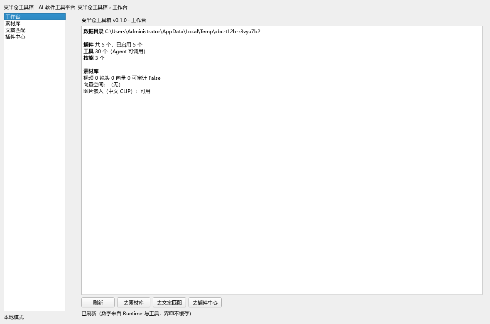
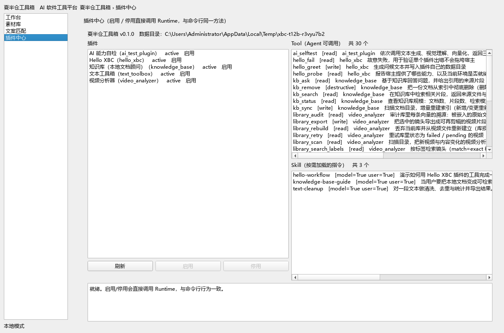
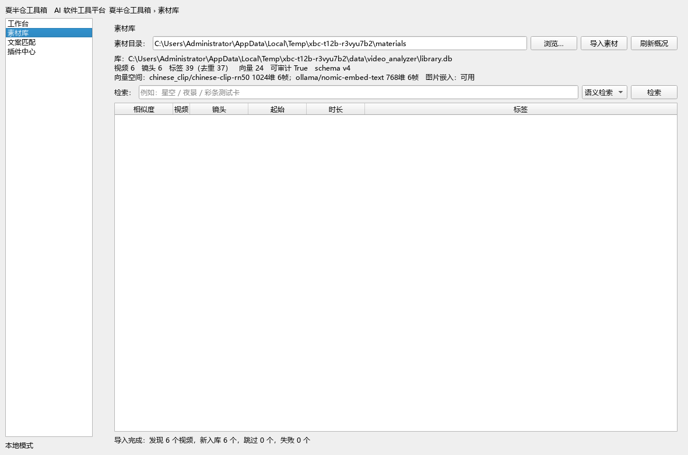
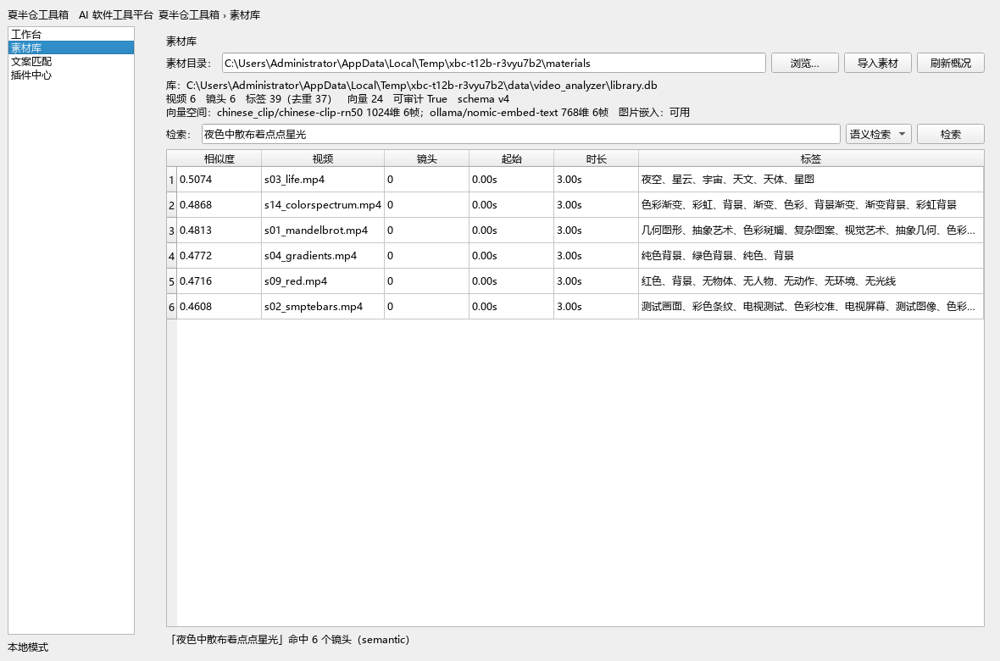
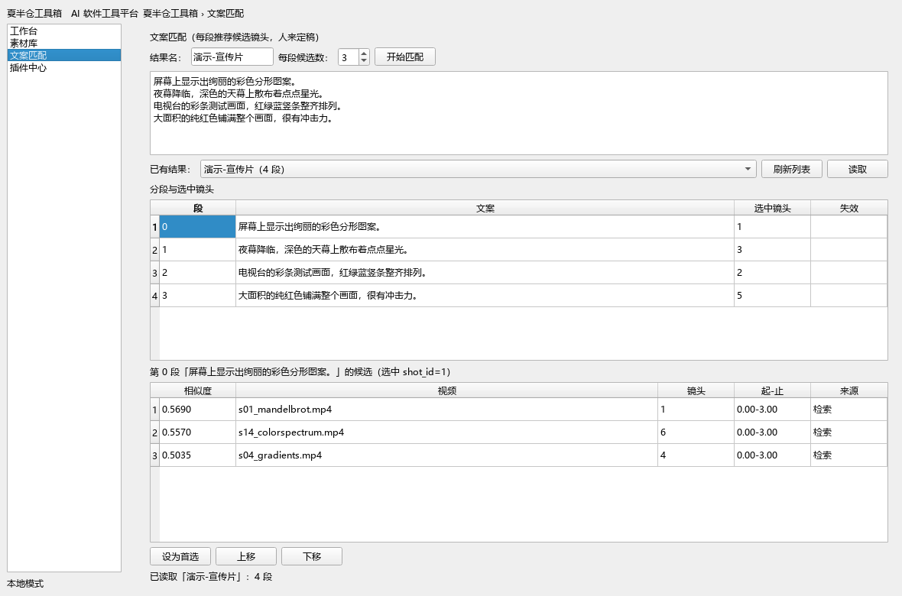
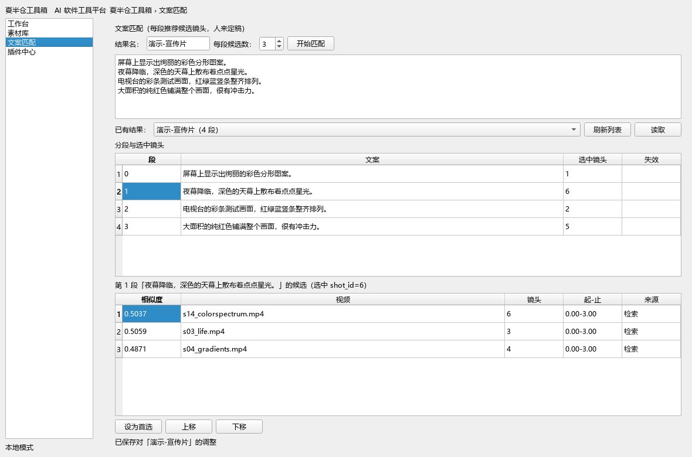

# TASK-012b 交付报告 —— 界面二期

| 项 | 内容 |
|---|---|
| 任务 | TASK-012b 界面二期（把命令行工具变成可点击操作） |
| 状态 | **完成** |
| 技术选型 | **PySide6**（继续用，不引入 Web 技术栈） |
| Core 改动 | **零改动** |
| 测试 | **451 项通过**（系统 Python + venv 双环境），新增 15 项 |
| 启动 | `python run.py ui` |
| 界面层依赖 | **只有 PySide6 + pathlib + typing**（无 sqlite / numpy / PIL / 插件模块） |
| 业务出口 | **只有 `ToolBridge.call(tool, **参数)`**，12 处调用点全在页面上 |

---

## 0. 验收对照

| 验收标准 | 结果 | 证据 |
|---|---|---|
| 1 能打开主界面 | ✅ | §3 截图 1；`MainWindowTests` 断言 4 个导航项 |
| 2 能导入素材并看到入库结果 | ✅ | §4 截图 2：6 个视频入库，概况显示镜头/标签/向量 |
| 3 能检索并看到结果 | ✅ | §4 截图 3：语义检索 top-1 命中 life |
| 4 能输入文案并看到匹配结果 | ✅ | §4 截图 4/5：4 段文案 ×3 候选，人工调整后存盘 |
| 5 全部通过现有工具调用，界面层无业务逻辑 | ✅ | §5 结构性证据（import 只有 4 个模块） |
| 6 附界面截图 | ✅ | §3/§4 共 6 张，都在 `docs/assets/` |

---

## 1. 关于原型

任务书提到"顾问提供过一版 HTML 原型（主界面）"。**它不在仓库里**，我在会话附件与磁盘上找到了它：

```
C:\Users\Administrator\Documents\deepseek-harness\默认工作区\xiahancang-shell\preview.html
```

看懂了它是什么、也看懂了它的**边界**：

- 它是**DSH 外壳的界面稿**（文件末尾自己写明："侧栏五个入口在插件里是 `sidebar.panellist`
  的列表条目 + `main` 槽里同 key 的页面，点击切换由 DSH 的 `ctx.layout.selectPanel(id)` 完成"）
- 品牌是夏半仓，结构是 **左侧导航 + 工作台 + 插件中心**
- 里面有些内容按任务书**属于不做**：插件商城（"统一账号 · 统一收费"）、企业空间、AI 中心、
  以及一处明确标注"未实现"的说明

**我怎么用它**：只取**结构**（左侧导航 + 工作台 + 插件中心这三块的信息组织方式），
**条目按本任务范围裁到四个**，并**没有**照搬 DSH 的 `panellist` / `ctx.layout` 机制 ——
XBC 是 PySide6 桌面程序，切换页面用 `QStackedWidget`。

导航最终就是四项，**没有"为将来预留"的入口**：

| 导航 | 页面 | 干什么 |
|---|---|---|
| 工作台 | `WorkbenchPage` | 看当前状态、去别的页 |
| 素材库 | `LibraryPage` | 导入素材、按标签 / 语义检索 |
| 文案匹配 | `MatchPage` | 输入文案、看 Top-N 候选、人工调整 |
| 插件中心 | `PluginsPage` | 启用 / 停用插件（复用 TASK-004 的面板） |

原型里提过的"我的插件 / 企业空间 / AI 中心 / 设置"**没做** —— 那属于插件商城 / 账号 / 云端，是禁止项。

---

## 2. 技术选型（B 类自主决定）

### 2.1 用 PySide6，不引入别的

| 选项 | 为什么不选 / 为什么选 |
|---|---|
| **PySide6（选它）** | 项目里**已经有**（TASK-004 的 `src/xbc/ui/shell.py` 就是），`pyproject.toml` 已声明；插件管理面板能直接复用；单机桌面程序，不需要额外运行时 |
| Electron / Tauri | 引入 Node 工具链，与"内核零依赖 + 单机"冲突；打包体积暴涨；现有 Python 能力层要再包一层 IPC |
| Web + 本地服务 | 等于多一个进程和一套 HTTP 契约，为"点按钮"付出的复杂度远超收益 |
| Tkinter | 标准库自带，但控件能力弱（表格、文件对话框都要自己拼），且项目已选了 Qt，两套 UI 栈没道理 |

**没有引入任何新依赖** —— 界面层 `import` 的顶层模块只有 `PySide6` / `pathlib` / `typing` / `__future__`。

### 2.2 界面组织：导航 + 页面栈，页面按职责拆文件

```
src/xbc/ui/
├── main.py           主窗口：左侧导航 + QStackedWidget
├── bridge.py         ToolBridge —— 界面与工具之间的唯一通道（含后台线程）
├── shell.py          插件管理面板 + 独立窗口（TASK-004 的，拆出可嵌入的 Panel）
└── pages/
    ├── base.py       Page 基类：bridge + busy/idle + 后台调用
    ├── workbench.py  工作台
    ├── library.py    素材库
    ├── match.py      文案匹配
    └── plugins.py    插件中心（包一层 PluginManagerPanel）
```

**为什么拆文件而不是塞一个类**：每个页面独立可测。测试里页面可以拿一个**假 bridge** 造出来，
不需要真的插件、真的素材、真的模型（§6 就是这么测的）。

### 2.3 怎么复用现有工具

**按名字调，不 import 插件。**

```python
class ToolBridge:
    def call(self, tool: str, **arguments) -> ToolResult:
        return self._ctx.tool_registry.call(tool, arguments)
```

页面里只有这一种调用方式。手册上写的"界面不做业务逻辑"因此**不是纪律，是结构**：
界面层 `import` 的顶层模块只有 `PySide6` / `pathlib` / `typing` ——
**它连业务代码都拿不到**（§5 有 ast 证据）。

> 为什么第一个参数叫 `tool` 而不是 `name`：`script_match` / `match_show`
> **自己就有个 `name` 参数**，叫 `name` 会直接 `TypeError: got multiple values`。
> 这是写第一版时**测试立刻撞出来的**（§7）。

### 2.4 慢操作走后台线程

`library_scan` 在真实素材上要几十秒（每个镜头都要过视觉模型）。同步调会把窗口冻住。

所以 `Page.background(tool, arguments, render)` 把**工具调用**丢到 `QThread`，
回来后**在主线程**渲染。**一次只跑一个**（跑的时候整页禁用），不做队列、不做并发。

每个动作同时保留同步实现（`page.scan()`）给测试用，两侧共用同一份取参数与渲染代码：

```python
def scan_arguments(self) -> dict: ...      # 取参数
def render_scan(self, result) -> None: ... # 渲染
def scan(self):      return self.call("library_scan", **self.scan_arguments())  # 同步
def on_scan(self):   self.background("library_scan", self.scan_arguments(), self.render_scan)
```

**按钮路径与测试路径不会分叉** —— 因为它们是同一份参数与渲染。

---

## 3. 主界面截图

### 工作台



### 插件中心



---

## 4. 端到端实测（通过界面自己的动作跑）

**不直接调工具** —— 全部走页面上的按钮方法（`page.scan()` / `page.search()` / `page.match()`
就是按钮的同步实现），6 个真实画面 + Ollama + 中文 CLIP。

### 导入素材



```
状态栏：导入完成：发现 6 个视频，新入库 6 个，跳过 0 个，失败 0 个
概况：视频 6　镜头 6　标签 39（去重 37）　向量 24　可审计 True　schema v4
向量空间：chinese_clip/chinese-clip-rn50 1024维 6帧；ollama/nomic-embed-text 768维 6帧
图片嵌入：可用
```

### 语义检索



查询「夜色中散布着点点星光」：

| 相似度 | 视频 | 标签 |
|---|---|---|
| **0.5074** | **s03_life.mp4** | 夜空、星云、宇宙、… |
| 0.4868 | s14_colorspectrum.mp4 | 色彩渐变、彩虹、… |
| 0.4813 | s01_mandelbrot.mp4 | 几何图形、抽象艺术、… |

**top-1 正确**（life 是黑底白点，星云感 —— 与 TASK-011 的报告一致）。

标签检索「测试」也走通了：命中 1 个镜头（`labels/fuzzy`）。

### 文案匹配 + 人工调整



4 段文案，每段 3 个候选：

| 段 | 文案 | top-1 命中 |
|---|---|---|
| 0 | 屏幕上显示出绚丽的彩色分形图案。 | mandelbrot ✅ |
| 1 | 夜幕降临，深色的天幕上散布着点点星光。 | life ✅ |
| 2 | 电视台的彩条测试画面，红绿蓝竖条整齐排列。 | smptebars ✅ |
| 3 | 大面积的纯红色铺满整个画面，很有冲击力。 | red ✅ |

**4/4 全对。**



人工调整（第 1 段）：

```
第 1 段的候选：3 个
     0.5059  s03_life.mp4            0.00-3.00  检索
     0.5037  s14_colorspectrum.mp4   0.00-3.00  检索
     0.4871  s04_gradients.mp4       0.00-3.00  检索

「设为首选」：选中 shot_id 3 → 6
状态栏：已保存对「演示-宣传片」的调整
「上移」后状态栏：已保存对「演示-宣传片」的调整
```

**存盘验证**：关掉窗口、重新开一个 `MainWindow`、重新读取 ——
`第 1 段选中 shot_id = 6`，**调整还在**。

---

## 5. 验收 5：界面层无业务逻辑（结构性证据）

### 5.1 界面层 import 的**全部**顶层模块

```
['PySide6', '__future__', 'pathlib', 'typing']
```

| 扫描 | 结果 |
|---|---|
| import 插件模块（`xbc_va*` / `plugins`） | **（无）** |
| import 业务/重型库（sqlite3 / numpy / PIL / onnxruntime / torch / requests） | **（无）** |

**界面层拿不到业务代码** —— 所以"不做业务逻辑"是结构性的，不靠自觉。

> 这条扫描有个坑：第一版把 `from . import plugins`（界面自己的 `pages/plugins.py`）
> 误判成"import 了顶层 `plugins` 包"。**相对导入必须跳过** —— 已修正。

### 5.2 页面对外的唯一出口

页面里显式调用的工具（12 处）：

```
base.py:17      library_scan          match.py:230    script_match
library.py:117  library_status        match.py:336    match_select
library.py:156  library_scan          match.py:357    match_reorder
library.py:186  library_search_semantic   match.py:378  match_show
library.py:187  library_search_labels     workbench.py:76  library_status
```

`video_analyzer` 一共 17 个工具，界面用到 6 个。
**没用到的 11 个是 Agent 专用**（`library_rebuild` / `library_export` / `video_analyze` …）——
界面**没有**为了"看起来功能全"给它们硬塞入口（那是"为将来预留"，禁止项）。

### 5.3 测试怎么证明这一点

`tests/test_ui_main.py::UiPurityTests` 三条 ast 扫描 + `PageWiringTests` 的**记录型 bridge**：

> 用一个**没有 `ctx`、没有注册表**的假 bridge 换掉真工具桥，页面照样跑得起来。
> 每个动作断言它**确实调了那个工具、参数也对**：
>
> ```python
> page.directory_edit.setText("D:/materials")
> page.scan()
> self.assertEqual(bridge.called_with("library_scan"), [{"directory": "D:/materials"}])
> ```

还有一条"**界面不算数**"的断言：工具返回什么，表格就画什么 ——
`0.9876` 原样显示、`shot_index=7` 原样显示、标签 `["甲","乙"]` 渲染成 `甲、乙`。

---

## 6. 改动清单

| 文件 | 行数 | 说明 |
|---|---|---|
| `ui/main.py` | 126 | **新**：主窗口 + 导航 + 页面栈 |
| `ui/bridge.py` | 137 | **新**：ToolBridge + BackgroundCall（后台线程） |
| `ui/pages/base.py` | 120 | **新**：Page 基类 |
| `ui/pages/workbench.py` | 101 | **新**：工作台 |
| `ui/pages/library.py` | 228 | **新**：素材库 |
| `ui/pages/match.py` | 401 | **新**：文案匹配 |
| `ui/pages/plugins.py` | 39 | **新**：插件中心 |
| `ui/pages/__init__.py` | 26 | **新** |
| `ui/shell.py` | 298 | **改**：拆成 `PluginManagerPanel` + `HostWindow`（API 不变） |
| `__main__.py` | — | **改**：`cmd_ui` 启动主界面并按 `smoke` 的顺序装配 manager |
| `tests/test_ui_main.py` | 15 项 | **新** |

### 为什么拆 `shell.py`

TASK-004 的 `HostWindow` 建的是 `QMainWindow`；主界面要把它**嵌进页面**。
所以拆成"面板 + 窗口"两层：`HostWindow` 只做装壳，公开属性/方法**全部转发**给面板。

**TASK-004 的 14 项界面测试一条没改、全过** —— API 一字未变。

### Core 零改动

`git diff HEAD -- src/xbc/core` → **（无）**。
界面层只用了 `ctx` 已有的公开成员：`tool_registry` / `paths` / `create_plugin_manager()` /
`skill_catalog`。**没有为界面加任何 Core 接口。**

---

## 7. 实现中修掉的三个真 bug

| # | 现象 | 根因 | 修法 |
|---|---|---|---|
| 1 | `TypeError: call() got multiple values for argument 'name'` | `ToolBridge.call(name, **kwargs)` 与 `script_match` 自己的 `name` 参数撞名 | 第一个参数改名 `tool`。**测试第一次运行就撞出来了** |
| 2 | 「设为首选」后候选列表**变空白** | `render_open` 先 `setRowCount(0)` 清表，却只靠 `currentCellChanged` 信号回填 —— **段号没变时信号不触发** | 设完当前行后**显式**调一次 `on_segment_changed()` |
| 3 | 导入完成后状态栏显示"概况已刷新"，看不到导入结果 | `render_scan` 先 `say(导入结果)`，再调 `show_status()` 把它覆盖了 | `show_status(note=...)` 支持自定义消息，导入结果为先 |

顺带两个小改进（不是 bug，但影响能用）：
- 「设为首选」/「上移」后**保持选中行与所在段**（原本会被踢回第一段、丢掉选中）
- 素材库表格的**标签列不再被截断**（视频列改自适应、标签列占剩余宽度）

---

## 8. B 类自主决定清单

| # | 决定 | 取值 | 理由 |
|---|---|---|---|
| 1 | **UI 框架** | **PySide6** | 项目已有、无新依赖、复用 TASK-004 的面板；Web 方案与"单机 + 内核零依赖"冲突 |
| 2 | **界面组织** | 左导航 + `QStackedWidget` + 一页一文件 | 每页可独立测试（假 bridge 就能造出来） |
| 3 | **工具复用方式** | **按名字调 `ToolRegistry.call`**，不 import 插件 | 这就是 Agent 调工具的同一套契约；界面连业务代码都拿不到 |
| 4 | **慢操作** | 后台 `QThread`，一次一个，整页禁用 | `library_scan` 几十秒，同步会冻窗口；不做队列/并发（不需要） |
| 5 | **导航条目** | 只做 4 项，一页对应一项 | "不做为将来预留的界面元素" |
| 6 | **插件管理** | 复用 `PluginManagerPanel`，**不写第二个实现** | 与 CLI 同一方法，状态一致性是结构性的 |
| 7 | **界面不缓存状态** | 每次切页/操作后**重新调工具或 Runtime** | 沿用 TASK-004 的做法；界面上的数字永远等于工具刚算的 |
| 8 | **失败呈现** | 直接把工具的 `message` 原文显示在状态栏 | 界面不解释、不美化错误，避免"界面猜的"与"工具说的"不一致 |
| 9 | **形状适配** | `_AsResult` 把 `script_match` 的返回包成 `match_show` 的形状 | **只做形状适配，字段照抄**；避免两套渲染分叉 |
| 10 | **不做美化** | 不写 `setStyleSheet`、不设图标、不用自绘控件 | 任务书硬约束，与 TASK-004 一致 |

---

## 9. 局限

1. **没有真的点过鼠标**：验收是**用页面的按钮方法**（按钮的同步实现）跑的，
   加上离屏渲染截图。**没有做 GUI 自动化点击**（`QTest.mouseClick`），
   所以"信号连接是否接对"靠的是代码审查与同步方法测试，不是点击测试。
   要补的话加 `QtTest` 即可，本次没做（不在范围）。
2. **截图是离屏渲染**（`QT_QPA_PLATFORM=offscreen` + 显式加载 `msyh.ttc`）。
   第一次渲染出来**全是豆腐块** —— offscreen 平台找不到字体目录。
   真机上跑 `python run.py ui` 用的是系统字体，不受影响。
3. **长任务不可取消**：后台线程跑起来就只能等完。没有取消按钮（任务书没要求，也没做预留）。
4. **没有素材缩略图 / 预览**：只显示视频文件名、时间码、标签。
   看画面要自己打开文件 —— 这算"美化"还是"功能"，我按"不在范围内"处理了。
5. **`library_rebuild` / `library_export` 没有界面入口** —— 它们是有用的工具，
   但任务书只要求"导入 / 查看 / 检索"与"文案匹配"。**没有为它们预留按钮。**
6. **插件中心的配置编辑没做**：只能启用/停用，不能改配置（那是 TASK-012 原表里的另一项）。

---

## 10. 复现

```powershell
python run.py ui
```

界面里：

1. **素材库** → 「浏览…」选素材目录 → 「导入素材」→ 看概况与结果表
2. 检索框输入「夜色中散布着点点星光」→ 选「语义检索」→「检索」
3. **文案匹配** → 填结果名 + 粘贴文案 + 每段候选数 → 「开始匹配」
4. 点某一段 → 点某个候选 → 「设为首选」/「上移」/「下移」
5. 关掉再打开，「已有结果」里选那份 → 「读取」，调整还在
6. **插件中心** → 启用 / 停用插件

```powershell
# 测试（离屏，不需要显示器）
python -m unittest discover -s tests
```

截图复现：`QT_QPA_PLATFORM=offscreen` 下用 `QWidget.grab().save(...)`，
**必须先 `QFontDatabase.addApplicationFont("C:/Windows/Fonts/msyh.ttc")`**，否则中文是方块。
